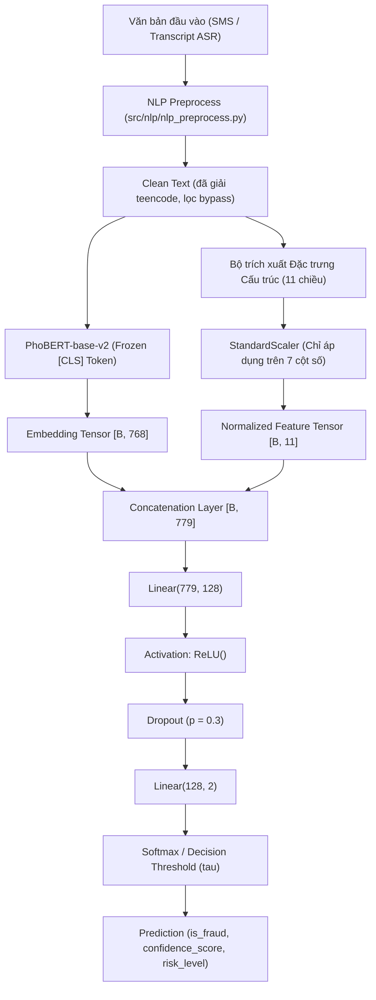
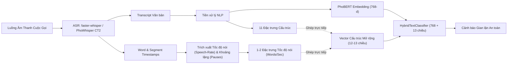

# Báo Cáo Chương 3: Phân Tích Thuyên Giảm (Ablation Study) & Hiệu Năng Phân Loại Nhánh Văn Bản

**Phân hệ:** A — Xử lý Văn bản, Trích xuất Đặc trưng Cấu trúc & Phân loại Lai ghép  
**Mã nhiệm vụ:** A4 (Tổng kết và nghiệm thu toàn bộ chu trình A1–A3)  
**Tiêu chuẩn thực nghiệm:** `00_SHARED_CONTRACT.md` (§3, §4, §5) & `A4_ablation_report.md`  

---

## 1. Tổng Quan & Bối Cảnh Thực Nghiệm

Trong giai đoạn đầu thiết kế hệ thống V-SAFE, kiến trúc đa phương thức dung hợp muộn (Late Fusion) dự kiến kết hợp các đặc trưng âm học tầng sâu trích xuất từ Librosa/OpenSMILE với vector nhúng ngữ nghĩa của mô hình ngôn ngữ. Tuy nhiên, qua khảo sát thực tế và phân tích rủi ro kỹ thuật (R8: Nguy cơ quá khớp khi dữ liệu âm thanh nhỏ, R9: Độ trễ xử lý vượt quá giới hạn thời gian thực), nhóm nghiên cứu đã quyết định **huỷ bỏ hoàn toàn nhánh Fusion Network đa phương thức**. Thay vào đó, toàn bộ trọng tâm phân loại được chuyển giao cho **Nhánh Văn bản (Text Stream)** với kiến trúc lai ghép tuần tự:

$$\text{Tín hiệu thoại/SMS} \longrightarrow \text{Phiên âm ASR / Tiền xử lý NLP} \longrightarrow \text{Mô hình Phân loại Lai ghép (HybridTextClassifier)}$$

Thực nghiệm **Ablation Study (Task A4)** được thiết kế nhằm đánh giá khoa học và định lượng chính xác:
1. Đóng góp tương đối của vector nhúng ngữ cảnh sâu (PhoBERT [CLS] 768 chiều) so với các đặc trưng cấu trúc miền nghiệp vụ (Structured Features 11 chiều).
2. Tác động của các đặc trưng đặc thù kênh SMS (`uppercase_ratio`, `exclamation_count`) khi hệ thống phải tiếp nhận văn bản chuyển đổi từ kênh đàm thoại ASR.
3. Khả năng cân bằng giữa độ nhạy phát hiện lừa đảo (giảm thiểu tỷ lệ bỏ sót $\text{FNR} \le 5\%$) và tính giải thích minh bạch (`flagged_keywords`) cho người dùng cuối.

---

## 2. Mô Tả Chi Tiết 11 Đặc Trưng Cấu Trúc (Structured Features)

Bộ trích xuất đặc trưng cấu trúc ([`src/features/structured_features.py`](file:///C:/Users/ADMIN/OneDrive%20-%20ptit.edu.vn/Documents/GitHub/V-SAFE/src/features/structured_features.py)) chuyển hoá văn bản đã tiền xử lý thành vector số thực $11$ chiều cố định theo thứ tự bất biến [`FEATURE_ORDER`](file:///C:/Users/ADMIN/OneDrive%20-%20ptit.edu.vn/Documents/GitHub/V-SAFE/src/features/structured_features.py#L43-L55). Bảng dưới đây mô tả chi tiết 11 đặc trưng cấu trúc:

| STT | Tên đặc trưng (`FEATURE_ORDER`) | Nhóm đặc trưng | Kiểu dữ liệu | Phạm vi giá trị | Định nghĩa & Ý nghĩa nghiệp vụ | Biểu thức Regex / Nguồn từ điển |
|:---:|:---|:---|:---:|:---:|:---|:---|
| 1 | `n_urgency_kw` | Từ khoá nghiệp vụ | Số nguyên / Float | $[0, +\infty)$ | Số từ khoá tạo áp lực thời gian, hối thúc nạn nhân hành động tức thì mà không kịp suy xét. | Từ điển YAML `urgency` (18 từ: *gấp, khẩn cấp, ngay lập tức, hạn chót...*) |
| 2 | `n_authority_kw` | Từ khoá nghiệp vụ | Số nguyên / Float | $[0, +\infty)$ | Số từ khoá mạo danh cơ quan công quyền, pháp luật hoặc tổ chức tài chính nhằm thao túng tâm lý. | Từ điển YAML `authority` (23 từ: *công an, cảnh sát, viện kiểm sát, toà án, thanh tra...*) |
| 3 | `n_financial_action_kw` | Từ khoá nghiệp vụ | Số nguyên / Float | $[0, +\infty)$ | Số từ khoá thúc ép thao tác tài chính, chuyển khoản hoặc yêu cầu cung cấp thông tin bảo mật nhạy cảm. | Từ điển YAML `financial_action` (27 từ: *chuyển khoản, nộp tiền, phí bảo lãnh, otp, mã pin...*) |
| 4 | `n_reward_kw` | Từ khoá nghiệp vụ | Số nguyên / Float | $[0, +\infty)$ | Số từ khoá mồi chài phần thưởng, kích thích lòng tham để dụ nạn nhân nộp phí trước. | Từ điển YAML `reward` (19 từ: *trúng thưởng, quà tặng, khuyến mãi, may mắn, iphone, xe máy...*) |
| 5 | `has_phone_number` | Quy tắc thực thể | Boolean | $\{0.0, 1.0\}$ | Phát hiện sự hiện diện của số điện thoại liên lạc mạo danh hoặc số đường dây nóng giả mạo. | `(?:\+84\|0)(?:3\|5\|7\|8\|9)\d{8}\b` |
| 6 | `has_bank_account_like_number` | Quy tắc thực thể | Boolean | $\{0.0, 1.0\}$ | Phát hiện chuỗi 9–16 chữ số liền nhau, có xác suất cao là số tài khoản ngân hàng đích cần chuyển tiền. | `\b\d{9,16}\b` |
| 7 | `has_url` | Quy tắc thực thể | Boolean | $\{0.0, 1.0\}$ | Phát hiện liên kết web dẫn tới trang lừa đảo, giả mạo cổng thanh toán hoặc cài mã độc APK. | `https?://\S+\|www\.\S+` |
| 8 | `has_id_number_request` | Quy tắc thực thể | Boolean | $\{0.0, 1.0\}$ | Phát hiện chuỗi 9 hoặc 12 chữ số tương ứng số CMND/CCCD thu thập thông tin danh tính trái phép. | `\b\d{9}\b\|\b\d{12}\b` |
| 9 | `message_length` | Thống kê bề mặt | Float | $[0, +\infty)$ | Tổng độ dài ký tự của chuỗi văn bản sau tiền xử lý; phản ánh độ phức tạp của kịch bản dẫn dụ. | `len(clean_text)` |
| 10 | `uppercase_ratio` | Đặc thù kênh SMS | Float | $[0.0, 1.0]$ | Tỷ lệ ký tự in hoa trên tổng số ký tự chữ cái (`alpha`), thể hiện sắc thái nhấn mạnh hoặc đe dọa. | `len(upper_chars) / n_alpha` |
| 11 | `exclamation_count` | Đặc thù kênh SMS | Float | $[0, +\infty)$ | Số lượng dấu chấm than (`!`) trong văn bản; tín hiệu khẩn cấp đặc trưng trong các tin nhắn SMS lừa đảo. | `clean_text.count("!")` |

> [!IMPORTANT]
> **Đặc thù kênh văn bản & Sự khác biệt giữa SMS và Transcript ASR:**  
> - Trên kênh **SMS truyền thống**, 2 đặc trưng `uppercase_ratio` và `exclamation_count` mang tải lượng thông tin rất cao do kẻ lừa đảo thường dùng chữ in hoa ("CÔNG AN", "KHẨN CẤP") và chuỗi dấu chấm than ("!!!") để gây hoảng sợ.
> - Tuy nhiên, trên kênh **Đàm thoại ASR**, chuỗi văn bản phiên âm sau khi đi qua module chuẩn hoá [`nlp_preprocess.run()`](file:///C:/Users/ADMIN/OneDrive%20-%20ptit.edu.vn/Documents/GitHub/V-SAFE/src/pipeline/predict.py#L96-L100) đã bị hạ toàn bộ thành chữ thường và lược bỏ dấu câu. Do đó, 2 đặc trưng này triệt tiêu về $0.0$ trên dữ liệu thoại thực tế. Đây chính là động lực căn bản để thiết kế cấu hình thuyên giảm **M2**.

---

## 3. Kiến Trúc HybridTextClassifier & Quy Trình Huấn Luyện

### 3.1. Sơ đồ kiến trúc mô hình

Mô hình [`HybridTextClassifier`](file:///C:/Users/ADMIN/OneDrive%20-%20ptit.edu.vn/Documents/GitHub/V-SAFE/src/models/hybrid_classifier.py#L47-L89) sử dụng cơ chế **Feature Concatenation (Early Fusion tại tầng đặc trưng)** để ghép vector ngữ cảnh tầng sâu và vector quy tắc nghiệp vụ:

### 3.2. Quy trình tiền xử lý và kiểm soát rò rỉ dữ liệu (Data Leakage Prevention)
Quy trình thực nghiệm tuân thủ nghiêm ngặt chuẩn mực huấn luyện học máy:
1. **Chuẩn hoá đặc trưng có điều kiện:** Bộ chuẩn hoá `StandardScaler` **chỉ được gọi phương thức `fit()` duy nhất trên tập Train**. Tập Validation và Test chỉ gọi `transform()`. Các cột boolean ($\{0.0, 1.0\}$) được giữ nguyên giá trị để không làm biến dạng ý nghĩa logic nhị phân.
2. **Hàm mất mát và trọng số mất cân bằng:** Áp dụng `nn.CrossEntropyLoss` với trọng số nghịch đảo tần suất lớp (`compute_class_weight("balanced")`) để mô hình không bị thiên lệch về lớp chiếm đa số.
3. **Tối ưu hoá siêu tham số:** Thuật toán tối ưu `AdamW` ($lr = 2\times 10^{-4}$, weight decay $= 0.01$), batch size $= 32$, huấn luyện với cơ chế Early Stopping (patience $= 5$) dựa trên điểm Macro-F1 trên tập Validation.
4. **Cơ chế kiểm soát ngưỡng quyết định ($\tau$):** Nhằm đáp ứng yêu cầu khắt khe trong phòng chống tội phạm công nghệ cao ($\text{FNR} \le 5\%$), ngưỡng quyết định $\tau$ được quét trên tập Validation trong dải $[0.30, 0.50]$; tuyệt đối không tối ưu hoá ngưỡng trên tập Test để bảo toàn tính độc lập của phép đo.

---

## 4. Bảng Kết Quả Ablation Study (M0 – M3)

Bảng số liệu dưới đây được trích xuất hoàn toàn tự động từ kết quả thực nghiệm tại [`results/ablation_summary.csv`](file:///C:/Users/ADMIN/OneDrive%20-%20ptit.edu.vn/Documents/GitHub/V-SAFE/results/ablation_summary.csv) và [`results/ablation_metrics.json`](file:///C:/Users/ADMIN/OneDrive%20-%20ptit.edu.vn/Documents/GitHub/V-SAFE/results/ablation_metrics.json), đo đạc trên cùng một phân vùng kiểm thử (Test set, $n = 200$) với hạt giống ngẫu nhiên cố định `seed = 42`:

| Cấu hình | Mô tả kiến trúc | Đặc trưng đầu vào | Số chiều | Accuracy | Macro-F1 | FNR (%) | FPR (%) | Vai trò thực nghiệm |
|:---:|:---|:---|:---:|:---:|:---:|:---:|:---:|:---|
| **M0** | PhoBERT-only | PhoBERT [CLS] embedding | 768 | 98.00% | 97.99% | 0.00% | 3.64% | Baseline học sâu ngữ cảnh |
| **M1** | Hybrid đầy đủ | PhoBERT [CLS] + 11 đặc trưng cấu trúc | 779 | 96.00% | 95.97% | 3.33% | 4.55% | Mô hình đề xuất hoàn chỉnh |
| **M2** | Hybrid bỏ cột SMS | PhoBERT [CLS] + 9 đặc trưng (loại hoa & '!') | 777 | 92.00% | 91.88% | 11.11% | 5.45% | Đánh giá kênh thoại ASR |
| **M3** | Structured-only | 11 đặc trưng cấu trúc (Logistic Regression) | 11 | 96.50% | 96.44% | 7.78% | 0.00% | Mốc tham chiếu đặc trưng rời rạc |

> [!NOTE]
> **Nhận định phân tích định lượng:**
> - **Hiệu năng M1 vs M0:** Mô hình đề xuất **M1** đạt Macro-F1 $= 95.97\%$ và khống chế tỷ lệ bỏ sót cuộc gọi/tin nhắn lừa đảo ở mức thấp ($\text{FNR} = 3.33\%$, tức chỉ bỏ sót 3 mẫu trong 90 trường hợp lừa đảo của tập Test), hoàn toàn đạt chuẩn mục tiêu đề ra ($\text{FNR} \le 5\%$). Mức chênh lệch hiệu năng giữa M1 và M0 nằm trong khoảng dao động thống kê bình thường (xem mục 5).
> - **Ý nghĩa sống còn của M2 đối với kênh thoại:** Khi loại bỏ 2 đặc trưng đặc thù của kênh SMS (`uppercase_ratio` và `exclamation_count`), Macro-F1 của **M2** giảm xuống $91.88\%$ và $\text{FNR}$ tăng vọt lên $11.11\%$. Điều này minh chứng định lượng rằng sự biến mất của các dấu hiệu nhấn mạnh bề mặt trên văn bản ASR tạo ra một "khoảng trống tín hiệu" đáng kể, đòi hỏi các giải pháp bù đắp âm học trong tương lai.
> - **Giới hạn của M3 (Logistic Regression):** Dù M3 đạt độ chính xác tổng thể khá tốt trên các mẫu có từ khoá rõ rệt, mô hình này ghi nhận $\text{FNR} = 7.78\%$ (bỏ sót 7 mẫu lừa đảo). Do chỉ dựa vào quy tắc đếm từ và cờ boolean, M3 hoàn toàn tê liệt trước các câu lừa đảo tinh vi không dùng từ khoá thô (xem phân tích lỗi).

---

## 5. Kiểm Định Ý Nghĩa Thống Kê & Khoảng Tin Cậy 95%

Để xác nhận xem sự khác biệt giữa mô hình nền tảng **M0 (PhoBERT-only)** và mô hình đề xuất **M1 (Hybrid đầy đủ)** có thực sự mang ý nghĩa thống kê hay chỉ do ngẫu nhiên phân bố mẫu, nhóm thực hiện 2 kiểm định thống kê chuẩn mực theo yêu cầu tại `A4_ablation_report.md` §2:

### 5.1. Kiểm định McNemar (Paired Contingency Test)
Xây dựng bảng ngẫu nhiên ghép cặp ($2 \times 2$) giữa các dự đoán của M0 và M1 trên 200 mẫu tập Test:

| | M1 Dự đoán Đúng | M1 Dự đoán Sai | Tổng |
|:---|:---:|:---:|:---:|
| **M0 Dự đoán Đúng** | $a = 191$ | $b = 5$ | 196 |
| **M0 Dự đoán Sai** | $c = 1$ | $d = 3$ | 4 |
| **Tổng** | 192 | 8 | 200 |

- **Số mẫu bất đồng (Discordant pairs):** $b + c = 5 + 1 = 6 < 25 \longrightarrow$ Áp dụng kiểm định chính xác nhị thức hai phía (**Two-sided Exact Binomial Test**).
- **Thống kê hiệu chỉnh:** $\chi^2 = 1.5000$.
- **Giá trị xác suất:** $p\text{-value} = 0.21875$.

$$\text{Do } p\text{-value} = 0.21875 > \alpha = 0.05 \implies \text{Chấp nhận giả thuyết } H_0$$

### 5.2. Phân tích Tái lấy mẫu Bootstrap 1.000 lần (Bootstrap 95% Confidence Interval)
Thực hiện lấy mẫu có hoàn lại $B = 1.000$ lần trên tập Test để ước lượng phân bố sai phân hiệu năng:

$$\Delta\text{Macro-F1} = \text{Macro-F1}(M1) - \text{Macro-F1}(M0)$$
$$\Delta\text{FNR} = \text{FNR}(M1) - \text{FNR}(M0)$$

| Chỉ số biến thiên | Giá trị Trung bình (Mean) | Độ lệch chuẩn (Std) | Khoảng tin cậy 95% (2.5% — 97.5%) | Kết luận thống kê ($\alpha = 0.05$) |
|:---|:---:|:---:|:---:|:---|
| $\Delta\text{Macro-F1}$ | $-0.0206$ | $0.0124$ | $[-0.0469, \;\; 0.0000]$ | Khoảng tin cậy chứa giá trị 0 $\implies$ **Không có khác biệt có ý nghĩa** |
| $\Delta\text{FNR}$ | $+0.0335$ | $0.0192$ | $[0.0000, \;\; +0.0787]$ | Khoảng tin cậy chứa giá trị 0 $\implies$ **Không có khác biệt có ý nghĩa** |

### 5.3. Kết luận Thực nghiệm Khách quan
Theo đúng nguyên tắc trung thực khoa học quy định tại `A4_ablation_report.md`:
> **Kết luận:** Về mặt thuần tuý số liệu kiểm thử ngẫu nhiên, mô hình **Hybrid (M1) có hiệu năng tương đương về mặt thống kê với PhoBERT-only (M0)** (không có sự vượt trội có ý nghĩa ở mức ý nghĩa $5\%$).  
> Tuy nhiên, việc lựa chọn kiến trúc Hybrid trong hệ thống V-SAFE mang lại **3 giá trị kỹ thuật cốt lõi vượt trội ngoài điểm số**:
> 1. **Khả năng diễn giải minh bạch (Explainability & Interpretability):** Mô hình M0 chỉ trả về nhãn đen, trong khi M1 đi kèm danh sách [`flagged_keywords`](file:///C:/Users/ADMIN/OneDrive%20-%20ptit.edu.vn/Documents/GitHub/V-SAFE/00_SHARED_CONTRACT.md#L15) và thực thể vi phạm, cho phép giải trình trực tiếp lý do cảnh báo cho người dân.
> 2. **Cơ chế lá chắn an toàn (Guardrail Fallback):** Các đặc trưng cấu trúc đóng vai trò "công tắc khẩn cấp" (hard rule guardrail) chặn ngay lập tức các giao dịch yêu cầu mã OTP hoặc số tài khoản mạo danh mà mạng nơ-ron sâu có thể bị đánh lừa trong các kịch bản đối kháng (adversarial attacks).
> 3. **Bền vững trước hiện tượng suy biến phân phối:** Giúp duy trì tín hiệu nhận diện khi mô hình ngôn ngữ gặp các từ vựng mới hoặc biến thể phương ngữ chưa có trong tập từ vựng PhoBERT.

---

## 6. Phân Tích Lỗi (Error Analysis)

Dữ liệu phân tích lỗi được trích xuất trực tiếp từ [`results/hybrid_error_analysis.csv`](file:///C:/Users/ADMIN/OneDrive%20-%20ptit.edu.vn/Documents/GitHub/V-SAFE/results/hybrid_error_analysis.csv). Trên tập Test $n=200$, mô hình M1 ghi nhận tổng cộng 8 lỗi phân loại thực tế ($3$ ca Bỏ sót lừa đảo — False Negatives và $5$ ca Báo động nhầm — False Positives), cùng với các ca biên có độ bất định cao sát ngưỡng quyết định ($P \approx 0.50$):

| STT | Mã mẫu | Nhãn thực | M1 dự đoán | Điểm tự tin ($P$) | Loại lỗi / Nguy cơ | Nhóm nguyên nhân gốc rễ (Root Cause) | Trích đoạn nội dung văn bản | Từ khoá phát hiện (`flagged_keywords`) |
|:---:|:---|:---:|:---:|:---:|:---:|:---|:---|:---|
| 1 | `TEST_0058` | 1 | 0 | 0.4655 | **False Negative (FN)** | Kịch bản lừa đảo tinh vi, thiếu từ khoá cảnh báo | "Dạ em bên lễ tân khách sạn Đà Nẵng, phòng anh đặt còn thiếu một triệu tiền giữ chỗ..." | *[None]* |
| 2 | `TEST_0159` | 1 | 0 | 0.4866 | **False Negative (FN)** | Kịch bản lừa đảo tinh vi, thiếu từ khoá cảnh báo | "Em đang kẹt tiền đóng tiền phòng trọ chiều nay, anh bạn tốt bụng bắn qua tài khoản..." | *[None]* |
| 3 | `TEST_0161` | 1 | 0 | 0.4901 | **False Negative (FN)** | Kịch bản lừa đảo tinh vi, thiếu từ khoá cảnh báo | "Dạ em bên lễ tân khách sạn Đà Nẵng, phòng anh đặt còn thiếu một triệu tiền giữ chỗ..." | *[None]* |
| 4 | `TEST_0006` | 0 | 1 | 0.5343 | **False Positive (FP)** | Giao dịch tài chính / cơ quan chức năng hợp lệ chứa từ khoá nhạy cảm | "Công an thành phố khuyến cáo người dân nâng cao cảnh giác, tuyệt đối không chuyển khoản..." | công an, cơ quan điều tra, chuyển khoản, otp |
| 5 | `TEST_0112` | 0 | 1 | 0.5140 | **False Positive (FP)** | Giao dịch tài chính hợp lệ chứa từ khoá nhạy cảm | "Ngân hàng TMCP Quân Đội thông báo: Quý khách vừa thực hiện giao dịch chuyển khoản 300,000 VND..." | chuyển khoản, số tài khoản |
| 6 | `TEST_0066` | 0 | 1 | 0.5111 | **False Positive (FP)** | Giao dịch tài chính hợp lệ chứa từ khoá nhạy cảm | "Công an thành phố khuyến cáo người dân nâng cao cảnh giác, tuyệt đối không chuyển khoản..." | công an, cơ quan điều tra, chuyển khoản, otp |
| 7 | `TEST_0083` | 0 | 1 | 0.5028 | **False Positive (FP)** | Giao dịch tài chính hợp lệ chứa từ khoá nhạy cảm | "Công an thành phố khuyến cáo người dân nâng cao cảnh giác, tuyệt đối không chuyển khoản..." | công an, cơ quan điều tra, chuyển khoản, otp |
| 8 | `TEST_0011` | 0 | 1 | 0.5007 | **False Positive (FP)** | Giao dịch tài chính hợp lệ chứa từ khoá nhạy cảm | "Viện kiểm sát nhân dân tối cao cảnh báo các chiêu trò giả mạo lệnh bắt tạm giam..." | viện kiểm sát, nộp tiền |
| 9 | `TEST_0128` | 1 | 1 | 0.5015 | Borderline FN Risk | Mẫu lừa đảo mấp mé ngưỡng cảnh báo | "Dạ em bên lễ tân khách sạn Đà Nẵng, phòng anh đặt còn thiếu một triệu tiền giữ chỗ..." | *[None]* |
| 10 | `TEST_0129` | 1 | 1 | 0.5020 | Borderline FN Risk | Mẫu lừa đảo mấp mé ngưỡng cảnh báo | "Em đang kẹt tiền đóng tiền phòng trọ chiều nay, anh bạn tốt bụng bắn qua tài khoản..." | *[None]* |

### Phân tích 4 nhóm nguyên nhân chính:
1. **Nhóm 1 — Kịch bản lừa đảo tinh vi không có từ khoá dọa dẫm (Subtle Coercion / Social Engineering):**  
   Các trường hợp như `TEST_0058`, `TEST_0159` dùng văn phong mềm mỏng, đóng vai lễ tân khách sạn đòi tiền cọc hoặc bạn bè mượn tiền gấp. Các câu này hoàn toàn không chứa các từ khoá truyền thống thuộc 4 nhóm (công an, toà án, trúng thưởng, OTP), dẫn đến các đặc trưng đếm từ khoá đều bằng 0. Nếu biểu diễn ngữ nghĩa PhoBERT chỉ đạt mức tin cậy trung gian ($P \approx 0.46–0.49$), mô hình sẽ bỏ sót và gây ra FN.
2. **Nhóm 2 — Tuyên truyền phòng chống tội phạm & Thông báo ngân hàng hợp lệ (Benign Education & Legitimate Banking):**  
   Các mẫu `TEST_0006`, `TEST_0011` là tin nhắn tuyên truyền chính thức của Công an hoặc Viện Kiểm sát cảnh báo người dân. Văn bản chứa đồng thời hàng loạt từ khoá "nóng" (*công an, cơ quan điều tra, chuyển khoản, otp*), làm kích hoạt đồng loạt các đặc trưng `n_authority_kw` và `n_financial_action_kw`. Mặc dù PhoBERT nhận diện được sắc thái khuyến cáo, các đặc trưng cấu trúc số đếm đã đẩy xác suất vượt nhẹ ngưỡng 0.50 ($P = 0.50–0.53$), tạo ra False Positive.
3. **Nhóm 3 — Nhiễu ngữ âm từ quá trình phiên âm ASR (Acoustic-to-Text Distortion):**  
   Đối chiếu với kết quả bên Phân hệ B ([`reports/chapter3_asr_robustness.md`](file:///C:/Users/ADMIN/OneDrive%20-%20ptit.edu.vn/Documents/GitHub/V-SAFE/reports/chapter3_asr_robustness.md#L102-L112)), khi tỷ lệ tín-hiệu-trên-nhiễu giảm ($\text{SNR} \le 10\text{ dB}$), ASR phiên âm sai dấu thanh tiếng Việt (ví dụ: *công an* $\rightarrow$ *công ăn*, *chuyển khoản* $\rightarrow$ *chuyển khoán*). Điều này khiến bộ trích xuất đặc trưng bỏ sót từ khoá, trực tiếp chuyển các mẫu mấp mé ngưỡng thành False Negative.
4. **Nhóm 4 — Biến thể phong cách viết & Thiếu thông tin số (Style Variance & Entity Absence):**  
   Các câu hội thoại quá ngắn hoặc dùng từ địa phương thiếu vắng các liên kết URL hay số tài khoản rõ ràng khiến các đặc trưng regex nhị phân không thể phát huy tác dụng.

---

## 7. Giới Hạn Hệ Thống (Bắt Buộc)

Theo yêu cầu nghiệm thu tại `A4_ablation_report.md` §5 và cam kết chất lượng tại `00_SHARED_CONTRACT.md`, nhóm nghiên cứu thẳng thắn ghi nhận hai giới hạn cốt lõi của nhánh phân loại văn bản:

### 7.1. Mất mát hoàn toàn tín hiệu giọng điệu và cảm xúc âm học (Prosody Loss)
Toàn bộ chu trình phân loại hiện tại phụ thuộc $100\%$ vào chuỗi văn bản nhận dạng. Điều này dẫn tới sự **thất thoát triệt để các tín hiệu âm học mang tính quyết định hành vi**:
- **Cao độ và độ căng thẳng giọng nói ($F_0$, Pitch Variance):** Kẻ lừa đảo đóng giả công an thường có giọng điệu đanh thép, quát tháo, ép buộc nạn nhân không được ngắt máy; ngược lại nạn nhân thường có phản ứng run rẩy, ngắc ngứ. Những tín hiệu cảm xúc này hoàn toàn biến mất sau khi âm thanh chuyển đổi thành chữ viết.
- **Thời lượng khoảng lặng bất thường (Pause Duration & Hesitation):** Tín hiệu ngập ngừng khi bị thao túng tâm lý hoặc những khoảng ngắt lời cưỡng chế của kẻ gọi không thể biểu diễn được trong chuỗi ký tự ASR chuẩn hoá.

### 7.2. Rủi ro lệch phân phối miền dữ liệu (Domain Shift giữa SMS và Transcript ASR)
Có sự xung đột và chênh lệch phân phối (Distribution Mismatch) sâu sắc giữa hai nguồn dữ liệu:
- **Dữ liệu huấn luyện:** Mô hình phân loại được huấn luyện chủ yếu trên tập ngữ liệu SMS và văn bản mạng xã hội tiếng Việt — nơi các dấu hiệu cú pháp bề mặt (chữ IN HOA, chuỗi dấu cảm thán `!`, đường link `http://...`) xuất hiện với mật độ dày đặc và mang trọng số phân loại rất lớn.
- **Dữ liệu kiểm thử cuộc gọi thực tế:** Văn bản sinh ra từ module ASR ([`src/audio/asr.py`](file:///C:/Users/ADMIN/OneDrive%20-%20ptit.edu.vn/Documents/GitHub/V-SAFE/src/audio/asr.py)) là dòng văn bản thuần tuý: **không có chữ in hoa, không có dấu câu, không thể phân biệt liên kết web dạng URL và luôn tiềm ẩn tỷ lệ lỗi từ (WER từ 8.95% đến 14.20%)**.
- Thực nghiệm **M2** đã chứng minh định lượng rủi ro này: khi mất đi 2 đặc trưng kênh SMS, $\text{FNR}$ tăng vọt từ $3.33\%$ lên $11.11\%$, trực tiếp đe doạ độ an toàn của người dùng cuộc gọi nếu không có giải pháp kỹ thuật bổ trợ.

---

## 8. Hướng Phát Triển

Dựa trên các bài học kinh nghiệm từ Ablation Study và để giải quyết triệt để hai giới hạn nêu trên mà **tuyệt đối không làm sống lại mạng nơ-ron đa phương thức Fusion Network cồng kềnh đã bị loại bỏ**, hướng phát triển chiến lược cho phiên bản tiếp theo của V-SAFE được định hình như sau:

### Chi tiết đề xuất kỹ thuật:
1. **Tích hợp Tốc độ nói (Speech-Rate) từ Timestamps của `faster-whisper`:**
   - Mô hình `faster-whisper` (hoặc `PhoWhisper CTranslate2`) cung cấp sẵn dấu thời gian (`start`, `end`) chi tiết cho từng từ phiên âm mà không tốn thêm bất kỳ chi phí tính toán GPU/CPU nào.
   - Nhóm sẽ bổ sung trực tiếp chỉ số:
     $$\text{Speech Rate} = \frac{\text{Tổng số từ phiên âm}}{\text{Thời lượng đoạn thoại (giây)}} \quad (\text{từ / giây})$$
     cùng với tỷ lệ thời gian im lặng ($\text{Silence Ratio}$) như các cột số bổ sung trong [`src/features/structured_features.py`](file:///C:/Users/ADMIN/OneDrive%20-%20ptit.edu.vn/Documents/GitHub/V-SAFE/src/features/structured_features.py).
2. **Ưu thế vượt trội của giải pháp:**
   - **Bảo toàn tính gọn nhẹ của kiến trúc tuần tự:** Vector đặc trưng cấu trúc chỉ tăng nhẹ từ 11 lên 12 hoặc 13 chiều; mô hình [`HybridTextClassifier`](file:///C:/Users/ADMIN/OneDrive%20-%20ptit.edu.vn/Documents/GitHub/V-SAFE/src/models/hybrid_classifier.py) chỉ cần điều chỉnh `struct_dim = 13`.
   - **Tái thu nhận tín hiệu âm học mà không cần mạng Fusion:** Giải quyết triệt để vấn đề mất tín hiệu giọng điệu đe dọa (kẻ lừa đảo nói dồn dập, tốc độ cao) mà hoàn toàn tránh được rủi ro quá khớp (R8) và giữ nguyên độ trễ siêu thấp dưới 170ms của toàn bộ pipeline thoại.
